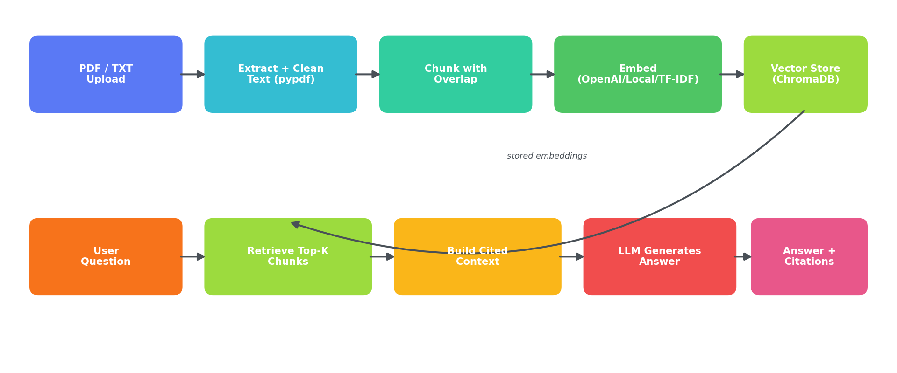

# 📄 DocuMind — Vertical RAG & Document QA Pipeline

**Upload your company's PDFs. Ask questions in plain English. Get answers grounded in — and cited back to — the exact page they came from.**

DocuMind is a full-stack Retrieval-Augmented Generation (RAG) application: a FastAPI backend that ingests documents, chunks and embeds them, stores them in a vector database, and answers questions using only the retrieved context — never the model's general knowledge — with a Streamlit chat interface on top.



---

## Why this exists

Generic ChatGPT-style tools will confidently answer questions about a company's internal policies, contracts, or manuals using knowledge from the open internet — which is exactly wrong. DocuMind restricts every answer to what's actually written in the uploaded documents, and shows the source excerpt behind every claim, so the answer is auditable, not just plausible.

## Features

- 📥 **Multi-document ingestion** — PDF and text/markdown, drag-and-drop via the UI or POST directly to the API
- ✂️ **Overlapping chunking** — word-window chunking with configurable overlap, so facts that fall on a chunk boundary are never lost mid-sentence
- 🧭 **Page-level citations** — every answer links back to the source filename *and page number*, not just "somewhere in the document"
- 🔌 **Pluggable embeddings** — OpenAI (`text-embedding-3-small`), local `sentence-transformers` (fully offline, data never leaves your machine), or a zero-dependency TF-IDF fallback for cost-free demos and CI
- 🔌 **Pluggable generation** — Claude (Anthropic), OpenAI, or a no-API-key "extractive" mode that pulls the most relevant sentences directly from the source — the whole pipeline runs and can be demoed with **zero API cost and zero API keys**
- 🗄️ **Persistent vector storage** — ChromaDB with on-disk persistence, so the index survives a restart
- 🌐 **Real backend/frontend separation** — FastAPI does the work over a documented HTTP API; Streamlit is just one possible client. Swap in a different frontend, a Slack bot, or a mobile app without touching the RAG logic
- 🚫 **Refuses to hallucinate** — if the answer isn't in the documents, the system says so explicitly instead of guessing

## Tech stack

`Python` · `FastAPI` · `Streamlit` · `ChromaDB` · `pypdf` · `scikit-learn` · Claude / OpenAI (optional)

## How it works

**Ingestion:** a PDF is read page-by-page (`pypdf`), de-hyphenated and whitespace-normalized, then split into ~250-word chunks with a 40-word overlap between consecutive chunks. Each chunk is embedded and stored in ChromaDB along with its source filename and page number.

**Retrieval + generation:** a question is embedded the same way, the top-k most similar chunks are retrieved, and those excerpts — tagged with their source and page — are passed to the LLM with an instruction to answer *only* from that context. The API returns the answer alongside the exact excerpts used, so a user can verify every claim in one click.

## Demo

> A sample generated PDF (`sample_docs/employee_handbook.pdf`) is included so you can try the full pipeline immediately with no setup beyond `pip install`.

<!--
  📸 Add screenshots here after your first local run:
  1. Start the backend and frontend (see below)
  2. Upload sample_docs/employee_handbook.pdf
  3. Ask: "How many days of annual leave do employees get?"
  4. Screenshot the chat answer with its expanded citations panel
  5. Save into assets/ and reference here, e.g.:

  
  
-->

## Getting started

```bash
git clone https://github.com/<your-username>/documind-rag.git
cd documind-rag
pip install -r requirements.txt
```

**1. Start the backend** (from `backend/`):

```bash
cd backend
uvicorn main:app --reload --port 8000
```

**2. Start the frontend**, in a second terminal (from the project root):

```bash
streamlit run frontend/app.py
```

Open the Streamlit URL, upload a PDF from the sidebar, and start asking questions.

### Running fully offline (no API key required)

By default DocuMind runs on `EMBEDDING_BACKEND=tfidf` and `LLM_BACKEND=extractive` — both work with zero external calls, so you (or a client) can try the whole pipeline before deciding whether to pay for OpenAI/Anthropic API access.

### Upgrading to production-quality answers

Set environment variables before starting the backend:

```bash
export EMBEDDING_BACKEND=openai        # or "local" for offline sentence-transformers
export OPENAI_API_KEY=sk-...
export LLM_BACKEND=anthropic           # or "openai"
export ANTHROPIC_API_KEY=sk-ant-...
```

## API reference

| Method | Endpoint | Description |
|---|---|---|
| `GET` | `/health` | Liveness check |
| `POST` | `/documents/upload` | Upload one or more PDF/text files (multipart form, field name `files`) |
| `GET` | `/documents` | List indexed source documents + chunk count |
| `DELETE` | `/documents` | Wipe the index |
| `POST` | `/ask` | `{"question": "...", "top_k": 4}` → answer + citations |

Interactive API docs are auto-generated by FastAPI at `http://localhost:8000/docs`.

## Project structure

```
.
├── backend/
│   ├── main.py           # FastAPI app + routes
│   ├── ingest.py          # PDF/text extraction + chunking
│   ├── embeddings.py       # Pluggable embedding backends
│   ├── vectorstore.py      # ChromaDB wrapper + persistence
│   ├── llm.py               # Pluggable generation backends
│   └── rag.py                # Retrieval + generation orchestration
├── frontend/
│   └── app.py             # Streamlit chat UI
├── sample_docs/
│   └── employee_handbook.pdf
├── assets/
│   └── architecture.png
└── requirements.txt
```

## Extending this for a client project

This is a real, working base to build a client deployment on top of — common next steps:

- Swap ChromaDB for a managed vector DB (Pinecone, Weaviate, pgvector) for multi-tenant production scale
- Add user authentication and per-user/per-team document isolation
- Ingest directly from a client's SharePoint, Google Drive, or Confluence instead of manual upload
- Add conversation memory so follow-up questions ("what about part-time employees?") resolve correctly
- Stream the LLM response token-by-token instead of waiting for the full answer
- Add an admin view showing which documents get queried most, and which questions return no good match — a strong signal for what documentation is missing

**Need this adapted to your document set and internal tools?** Open an issue or get in touch — happy to scope a custom deployment.

## License

MIT
